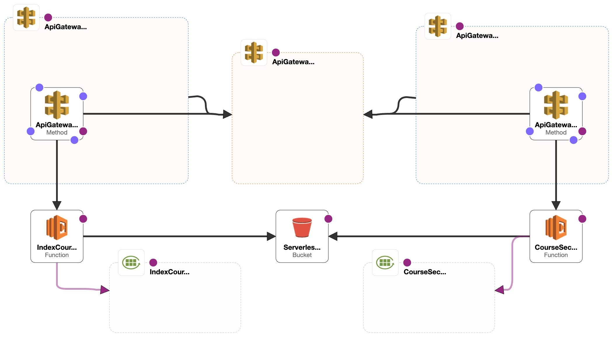

<h1 align="center">Portfolio Use Only</h1>

> :warning: **Important Note**

This repository and its contents, including installation and deployment instructions, are provided for portfolio review and demonstration purposes only. While the repository is publicly viewable and its code can be executed for review purposes, no license is granted for any further use, distribution, or reproduction of the materials contained herein. Any such activities are prohibited without express permission from the repository owner. Please contact the owner for any questions or requests for use.

# s2e-backend

## Table of Contents
- [Description](#description)
- [Prerequisites](#prerequisites)
- [Installation](#installation)
- [Deployment](#deployment)
- [APIs](#apis)
- [Architecture](#architecture)
- [Technologies](#technologies)
- [Contact](#contact)

## Description

This is the backend service for the s2e (StudyToEvolve) mobile application. It's built with serverless architecture on AWS, utilizing services like AWS Lambda, API Gateway, and more to handle requests from the frontend application.

## Prerequisites

Before you begin, ensure you have met the following requirements:
- You have installed the latest version of [Node.js and npm](https://nodejs.org/)
- You have installed the [Serverless framework](https://www.serverless.com/framework/docs/getting-started/)
- You have installed the [AWS CLI](https://aws.amazon.com/cli/)
- You have an AWS account with appropriate access rights
- You have an API key from Openai [Openai](https://openai.com/)

## Installation

### Installing
    To install s2e-backend, follow these steps:
    1. Clone the repository:
    ```
    git clone https://github.com/yourusername/s2e-backend.git
    ```

    2. Navigate into the project directory:

    ```
    cd s2e-backend
    ```
    3. Install the dependencies:

    ```
    npm install
    ```
    4. Define enviromental variables in a env.ts file in the root directory, as below:

    ```
    export const envVars = {
        STAGE: 'xxx',
        AWS_DEFAULT_REGION: 'xxx',
        OPENAI_API_KEY: 'xxx',
        ...process.env,
    }
    ```

## Deployment

To deploy the backend, run the following command:

```
serverless deploy
```

After the deployment, you will receive the API endpoints, which can be used in the s2e frontend application.


## APIs

The `s2e-backend` contains two main AWS Lambda functions that handle the necessary calls to the OpenAI API:

1. **Get Course Index** - This function generates a course index based on the user input provided from the frontend. This is facilitated by sending a request to the OpenAI API with the appropriate parameters. This Lambda function is triggered by a GET request at the `/indexCourse` endpoint.

2. **Get Quiz Section** - This function retrieves a quiz for a specific course section. It makes a request to the OpenAI API, then constructs and returns a quiz based on the response. This Lambda function is triggered by a GET request at the `/courseSectionQuiz` endpoint


## Architecture

This architecture is designed around the Serverless framework, using AWS Lambda functions for computation, Amazon API Gateway for HTTP request handling, and AWS CloudWatch for logging.



## Technologies

The `s2e-backend` utilizes various technologies and packages for its implementation:

1. **Node.js** - An open-source, cross-platform, JavaScript runtime environment that executes JavaScript code outside of a web browser.

2. **TypeScript** - An open-source language that builds on JavaScript by adding static type definitions. This project was built using TypeScript version 4.9.5.

3. **AWS Lambda** - A serverless compute service that lets you run your code without provisioning or managing servers.

4. **Axios** - A promise-based HTTP client for the browser and Node.js. Axios makes it easy to send asynchronous HTTP requests.

5. **OpenAI API** - Used to interact with the OpenAI GPT-3.5 model for course index generation and quiz creation.

6. **Serverless Framework** - An open-source deployment framework that allows developers to build and deploy auto-scaling, pay-per-execution, event-driven functions.


## Contact

If you want to contact me you can reach me at:

- **Name**: `Jordi Parra Porcar`
- **Email**: `jordiparraporcar@gmail.com`
- **LinkedIn**: [`Jordi Parra Porcar`](https://www.linkedin.com/in/jordiparraporcar/)


